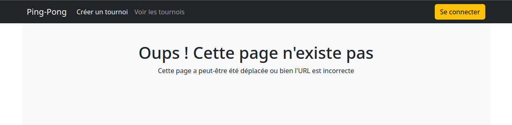

# Avant-Propos

## Description

Il s'agit de l'implémentation du frontend en `Angular`à partir de l'API fournie sur ce [repository](https://github.com/Arnaud-Nauwynck/sample-tournament-app).
Le site web développé est entièrement responsive.


## Limitations
Il convient de noter que le backend fourni n'a pas été modifié pour permettre de se focaliser sur le frontend.
Bien que la base de l'API ait été posée, elle n'est pas complète, impactant certaines fonctionnalités du front. Par exemple, l'absence de route `GET` pour l'utilisateur rend difficile l'inscription à un tournoi.
La connexion ici est simulée en ne demandant que le nom et l'inscription à un tournoi n'est actuellement pas possible.

# Lancement

## Backend
C'est configuré pour se lancer à l'adresse `http://localhost:8080/`

## Frontend

Le site est accessible à l'adresse `http://localhost:4200`. Il suffit de placer dans le dossier `frontend` et de lancer :
```bash
ng serve
```
# Captures d'écran

## Formulaire création tournoi


## Détail tournoi


## Liste des tournois


## Connexion


## Page 404
